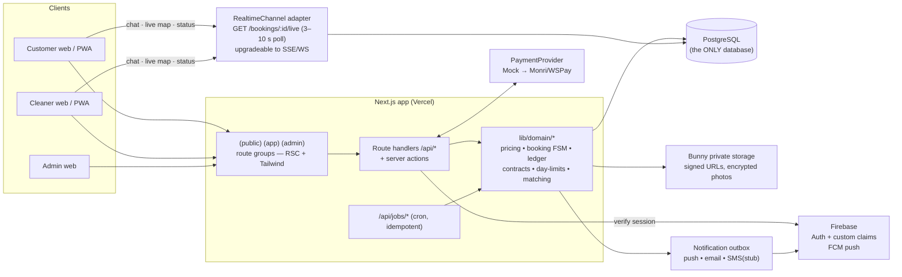
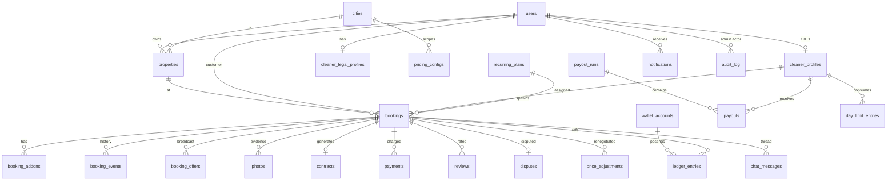
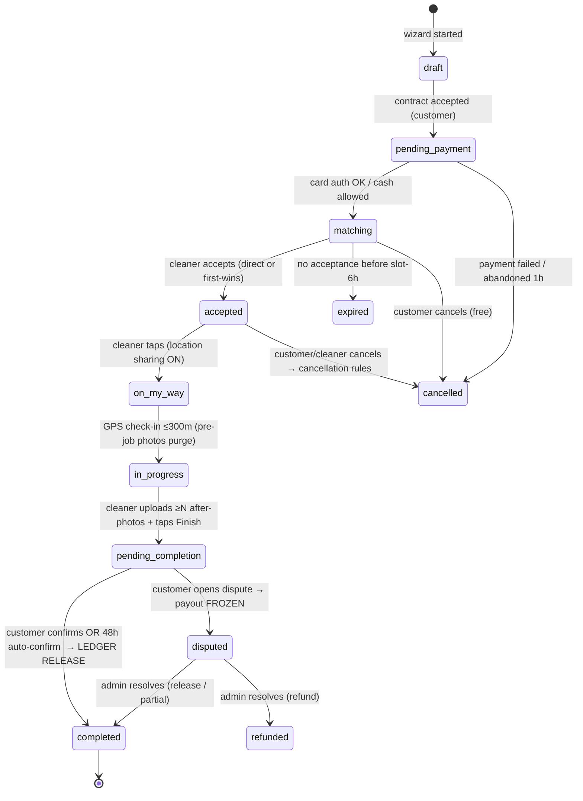
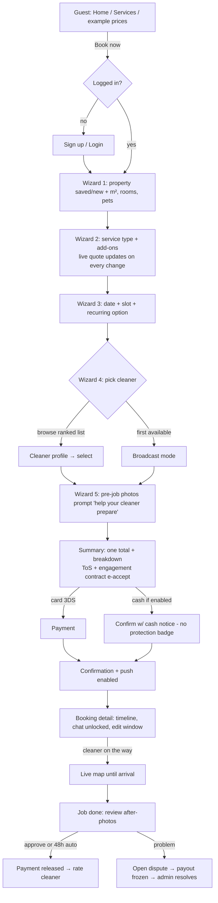
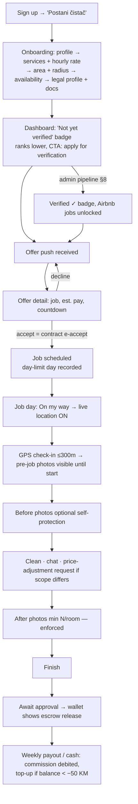

# TipTop365 — Technical Plan & Architecture
### "Uber for Cleaning" marketplace for Bosnia and Herzegovina

**Status:** DRAFT v1.1 — for approval before implementation starts (per build prompt §10.1). v1.1 = decision review revisions (D3, D7, D14), new D19–D22, §20 UX/UI plan, §21 Batmaid-trio growth path.
**Date:** 2026-07-12
**Repo:** https://github.com/Cevra/TipTop365 (branch `master` = canonical HEAD)

---

## Table of Contents

1. [Repo Analysis — what exists today](#1-repo-analysis)
2. [Decision Log (D1–D18)](#2-decision-log)
3. [Target Architecture](#3-target-architecture)
4. [Data Model](#4-data-model)
5. [Booking Lifecycle State Machine](#5-booking-lifecycle-state-machine)
6. [Pricing Engine](#6-pricing-engine)
7. [Payments & Escrow Ledger](#7-payments--escrow-ledger)
8. [Legal / Contract Layer](#8-legal--contract-layer)
9. [Photo Handling & Retention](#9-photo-handling--retention)
10. [API Surface](#10-api-surface)
11. [Screens & Design Flow](#11-screens--design-flow)
12. [Cross-cutting Concerns](#12-cross-cutting-concerns)
13. [Work Plan — Epics & Tasks](#13-work-plan--epics--tasks)
14. [Testing Strategy](#14-testing-strategy)
15. [Change Tracking Convention](#15-change-tracking-convention)
16. [Environment Variables](#16-environment-variables)
17. [Risks & Open Questions](#17-risks--open-questions)
18. [Verification Gates — Test-After Steps](#18-verification-gates--test-after-steps)
19. [Execution Playbook — Running This Plan with Claude Code](#19-execution-playbook--running-this-plan-with-claude-code)
20. [UX/UI Working Plan](#20-uxui-working-plan)
21. [Growth Path — The Batmaid Trio](#21-growth-path--the-batmaid-trio)

---

## 1. Repo Analysis

### 1.1 Current stack (verified from source)

| Layer | Today | Verdict |
|---|---|---|
| Framework | Next.js **14.2.3**, App Router, TypeScript 5 | ✅ Keep |
| Styling | Tailwind 3.4 (custom green palette `primary.500 #0B4B2D`) **+ MUI 5 + Headless UI + Flowbite + styled-components** | ⚠️ Keep Tailwind + Headless UI; freeze & phase out MUI/Flowbite/styled-components (4 UI systems = churn) |
| Auth | Firebase Auth (email/password, phone-confirm helper in `utils/auth.ts`) | ✅ Keep, extend with custom claims + server session |
| Data | Firestore, **client-side SDK writes directly from pages** — collections: `users`, `providers`, `address`, `services`, `bookings` | ❌ Replace as system of record (see D3); keep Firestore only as realtime channel |
| Storage | Firebase Storage + `bunnycdn-storage` dep | ✅ Keep Bunny (private zone + token auth) behind a `StorageProvider` interface |
| Server code | **None.** Zero API routes, zero server actions | ❌ Must build — all money/booking logic becomes server-authoritative |
| i18n | None (UI mixes Bosnian `usluge` and English) | ❌ Build with `next-intl`, `bs` default + `en` |
| Tests / CI | None | ❌ Build (Vitest + Playwright + GitHub Actions) |
| Design | Figma linked in README | ✅ Source of truth for UI |

### 1.2 Existing pages & models (reused as foundations)

- Routes: `/` (provider list), `/login`, `/signUp`, `/Profile/[id]` + `/edit` (865 + 818 lines — split during rebuild), `/become-provider` (588-line form), `/book-service` (minimal form → `bookings`), `/usluge` (hard-coded catalog), `/faq`, `/aboutUs`, `/uplaodImage` (typo route)
- Models in `app/models/`: `User.ts` (roles `'regular' | 'provider'`, availability slots, `BookingRequest` with `pending/accepted/rejected/completed`), `ServiceProvider.ts` (**duplicate, conflicting** shape), `Profile.ts`, `Address.ts`
- Components: `NavBar`, `HeroSection`, `Footer`, `ServiceCard`, `ServiceGrid`, `Icons`

### 1.3 Defects found (fixed in E0)

1. **`middleware.ts` is non-functional**: uses client `auth.currentUser` inside Edge middleware (always `null` on the server) and reads `user.role`, which doesn't exist on a Firebase `User`. Route protection currently does nothing.
2. **`next.config.js` (whitespace-only) shadows `next.config.mjs`** — the real config never loads.
3. **No `firestore.rules` / `firebase.json` in repo** — rules live only in the console (or DB is open). Client-side writes to `bookings`/`providers` are unprotectable for money flows.
4. Two conflicting `ServiceProvider` interfaces; `Profile.ts` stores numbers as strings.
5. `app/uplaodImage` typo route; `main` and `master` branches have diverged (HEAD = `master`).
6. No `.env.example`; Firebase config crashes at build if env vars missing (`String(undefined)` → `"undefined"`).

**Conclusion:** the repo is an early-stage UI prototype with working auth, branding, and provider-profile CRUD. We keep the framework, brand, auth, and page skeletons, and build the entire transactional core (server API, relational data, payments, contracts) around them. This satisfies "extend, don't restart" — every existing screen is upgraded in place.

---

## 2. Decision Log

Each decision: **what / why / alternative rejected**. These are the "every decision mapped" items; anything not listed follows the existing repo convention.

| # | Decision | Why | Rejected alternative |
|---|---|---|---|
| **D1** | Keep **Next.js 14 App Router + TS + Tailwind**; single app, three route groups `(public)`, `(app)`, `(admin)` | Extend-not-rebuild; team knows it; SSR + API in one deployable | Separate admin SPA (more infra, no benefit at this scale) |
| **D2** | **Server-authoritative core**: all writes for bookings/money/contracts go through Next.js Route Handlers + server actions using `firebase-admin` for identity. Client-side Firestore *writes* are removed | Pricing integrity, escrow, day-limits and audit cannot be enforced by client rules; current middleware proves the client-only model is already broken | Firestore security-rules-only enforcement (can't express double-entry invariants, day-limit counting, price recomputation) |
| **D3** *(v1.1 revised)* | **PostgreSQL (managed, EU region — Neon) + Prisma is the ONLY database.** Firebase is reduced to **Auth + FCM push**. Realtime UX (chat, live map, status) = **short-interval polling behind a `RealtimeChannel` adapter**: one `GET /api/bookings/:id/live?cursor=` endpoint polled every 3–5 s while a chat/tracking screen is open, 10 s for the map. SSE/WebSocket (or a realtime service) is a drop-in upgrade behind the same adapter if polling ever shows strain | Escrow needs a double-entry ledger, accounting needs SQL exports, day-limits need `COUNT(DISTINCT day)`, matching needs row-level locking. **v1.1:** the v1 plan kept Firestore as a realtime mirror — dropped after review: dual-write consistency, a security-rules surface, and a second store to seed/test bought us nothing a 3-second poll doesn't give at MVP scale. One database = one truth = fewer failure modes | v1's Postgres+Firestore hybrid (dual-write hazard, two mental models); all-in Firestore (weak for ledger/reporting); all-in Supabase (discards working Firebase Auth); WebSockets day-1 (serverless-hostile, premature) |
| **D4** | **Firebase Auth stays.** Server sets custom claims `{ role: 'customer'\|'cleaner'\|'admin', verified: bool }`; login exchanges ID token for an **httpOnly `__session` cookie** (firebase-admin `createSessionCookie`); `middleware.ts` rewritten to gate `(app)`/`(admin)` on that cookie | Keeps existing signup/login code and users; gives SSR-safe, spoof-proof role checks | NextAuth migration (throwaway work, re-onboards users) |
| **D5** | Money stored as **integer fenings** (1 KM = 100 f) everywhere; currency `BAM`, displayed as "KM" | Float money bugs; ledger invariants need exact integers | Decimal columns (Prisma Decimal ok but integer is simplest & fastest) |
| **D6** | **`PaymentProvider` interface** with three impls: `MockProvider` (dev/CI) → `MonriProvider` (primary; 3DS2, tokenization, preauth/capture) → optional `WSPayProvider`. Stripe-shaped interface so other markets can swap | Prompt requirement; Monri is the dominant BiH PSP; mock-first unblocks the whole flow before merchant onboarding | Direct Stripe (poor BiH acquiring support) |
| **D7** *(v1.1 refined)* | **Escrow = platform merchant account + internal double-entry ledger.** Card policy at MVP: **capture immediately at booking** — the ledger holds funds in `customer_escrow`; refunds are issued via PSP refund on cancellation. Auth-then-capture is a **later optimization** (preauth windows ~7 days create expiry edge cases for bookings scheduled further out — not worth it at launch). Payouts: **weekly payout run generates a bank-transfer CSV** for the operator + marks ledger — no programmatic payout API exists in BiH; manual bank upload is the honest reality | This is the core value prop (§6); ledger gives dispute-freeze, cash-commission debt, negative-balance blocking for free; immediate capture removes an entire class of PSP edge cases (expired auths, re-auth flows) at launch | Auth+capture day-1 (preauth-expiry complexity for zero customer-visible benefit); real e-money escrow account (regulatory overkill for MVP) |
| **D8** | **Background jobs = Vercel Cron → idempotent `/api/jobs/*` endpoints** secured with `CRON_SECRET` header. Jobs: photo-retention (hourly), auto-confirm 48 h (hourly), recurring-booking generator (daily), day-limit warnings (daily), payout-run prep (weekly), contract archive cleanup (daily) | No extra infra; each job is a plain testable function; portable to node-cron on a VPS later | Dedicated worker + queue (premature; revisit if job volume grows) |
| **D9** | **i18n via `next-intl`**: locale-prefixed routes `/bs/*` (default) and `/en/*`, all strings in `messages/bs.json` + `messages/en.json`, `Intl` for KM currency and `d.M.yyyy` dates. Existing routes get renamed to English canonical segments with localized labels (`/usluge` → `/[locale]/services`) | App Router native, server-component friendly | i18next (heavier client bundle), per-page ad-hoc strings (status quo, unmaintainable) |
| **D10** | **Notifications via outbox pattern**: every status transition inserts `notification` rows in the same DB transaction; a dispatcher sends FCM web-push + email (Resend/SMTP) + SMS (interface stubbed for MVP) and marks delivery. Templates bilingual | Korpa-style "push for every status change" with at-least-once delivery and full audit | Fire-and-forget sends inside request handlers (lost on failure) |
| **D11** | **Matching**: customer picks a cleaner (direct offer) or "first available" (broadcast `booking_offers` to all matching cleaners; accept executes `UPDATE booking SET cleaner_id=… WHERE id=… AND cleaner_id IS NULL` in a transaction — **first-accept-wins, race-safe**). Ranking: verified badge → rating → distance → price | Prompt §3.5; Postgres conditional update is the simplest correct race arbiter | Queue/lock service (unneeded) |
| **D12** | **Feature flags in DB** (`feature_flags` table, env override, typed accessor): `ALLOW_UNVERIFIED_BOOKINGS`, `CASH_PAYMENTS_ENABLED`, `LIVE_MAP_ENABLED`, `SMS_ENABLED` | Prompt requires flagging unverified bookings; admin-togglable without deploy | Env-only flags (needs redeploy, no admin UI) |
| **D13** | **Admin panel = `(admin)` route group** in the same app; every admin mutation goes through an `audit()` wrapper writing `audit_log`. Impersonation = short-lived scoped session cookie, banner shown, all actions audited | Prompt §8; one deployable; audit by construction | Retool/external admin (data leaves our control, no audit) |
| **D14** *(v1.1 refined)* | **Geo**: cities table + zone polygons deferred — MVP uses city + cleaner service-radius (km, haversine). Address geocoding via Google Geocoding API behind a `GeoProvider` interface. Live location = pings to our API (polled per D3), server-toggled visibility. GPS check-in = distance ≤ radius (**admin-config per city, default 300 m**); out-of-radius cleaners may **manually check in with a mandatory doorway photo → booking auto-flagged for admin review** — GPS is unreliable in dense apartment blocks, basements and elevators, and a hard block would strand legitimate cleaners | Sarajevo-first with multi-city columns from day one (§1); field reality beats GPS idealism — the photo + flag preserves the anti-fraud intent | PostGIS day 1 (premature); hard GPS gate (false negatives punish honest cleaners on job day) |
| **D15** | **Contracts**: HTML → PDF via headless Chromium (`@sparticuz/chromium` + `puppeteer-core`, works on Vercel) from admin-editable bilingual templates with `{{placeholders}}`; SHA-256 of the PDF + acceptance timestamps/IP stored; PDFs in private storage. All templates carry a "requires legal review" watermark until admin marks them lawyer-approved | Real templates are lawyer-owned documents — HTML editing is accessible to them; hash+timestamp gives e-acceptance evidence | `pdf-lib` layout by hand (painful for legal text); DocuSign (cost, overkill) |
| **D16** | **Photo security**: private Bunny storage zone; serve via short-TTL (≤5 min) signed URLs from our API after per-request authorization; pre-job customer photos additionally **AES-256-GCM encrypted app-side** (per-booking data key) + server-side watermark ("TipTop365 • <cleaner name>") on delivery; retention via cron (§9) | §3.7/§4 requirements: only-assigned-cleaner visibility, screenshot discouragement, hard-delete schedules | Public CDN URLs w/ obscure names (not access-controlled), client-side watermark (bypassable) |
| **D17** | **Testing**: Vitest (unit: pricing, ledger, day-limits, retention selector), Prisma + Postgres (Testcontainers/Neon branch) for integration, **Playwright** for E2E happy paths, GitHub Actions CI on PR. The four §10 high-risk components each get a dedicated suite before their feature is merged | Prompt requirement; repo currently has zero tests | Jest (Vitest is faster/TS-native) |
| **D18** | **Branch hygiene**: `master` is canonical (current HEAD); `main` gets archived. Work lands via feature branches `tiptop-<n>-<slug>` (existing convention) with conventional-commit messages, PRs to `master`, `CHANGELOG.md` updated per merge, ADRs appended to this doc's §2 | "Keep track of the changes" — every rebuild step is visible and revertable | Committing straight to master (no review trail) |
| **D19** | **Engagement-model seam (Batmaid trio, §21).** `engagement_model` enum — `marketplace` (now) / `payroll_service` / `employed` — on `cleaner_profiles` and snapshotted on `bookings`. Four modules are built parameterized from day 1 so future models bolt on without surgery: pricing takes a **rate source** (cleaner-set now, platform-set for employed), contracts take a **template kind** (temp-work now; payroll-mandate & employment later), ledger account types are generic strings, matching filters by model. **No payroll math, no shifts, no employment logic is built now** | Batmaid's proven evolution (Batwork marketplace → Batsoft payroll service → Batmaid employed staff) is the roadmap; the seam costs a few columns today, retrofitting costs a migration of every money table later | Building payroll/employment now (premature — no revenue behind it yet); ignoring it (schema surgery in year 2) |
| **D20** | **Field-reality resilience**: cleaner photo uploads go through an **offline-tolerant queue** (IndexedDB + background retry via service worker) — capture works with zero bars, syncs when signal returns; plus the D14 manual check-in override | Cleaners work in basements, concrete stairwells and elevators on prepaid mobile data; a hard network dependency at the *proof-of-work* moment breaks the escrow release chain exactly where it hurts most | Direct-to-API upload only (job completion hostage to signal) |
| **D21** | **Ops baseline from E0**: Sentry (client + server) with release tagging, Neon point-in-time recovery verified + nightly logical dump to Bunny, a **staging environment** (own DB + Monri sandbox + seed refresh), uptime monitoring on cron endpoints (dead-man switch — a *silent* retention/payout job failure is the worst kind) | Money bugs you can't see are money bugs you ship; a QA-led project should refuse to fly blind | "Add observability later" (later = after the first silent payout failure) |
| **D22** | **UX process = design-in-code (§20)**: locked design tokens → component library with a living `/styleguide` route → per-screen blueprint → **disposable HTML prototype approved on a real phone → implement**. Figma stays source of truth only for brand/marketing pages already designed there | No designer on the team; Figma-first for ~35 app screens would gate the build on a skill nobody has, while marketplace UX is a solved pattern language (Batmaid wizard, Bolt driver flow, Korpa tracking, Airbnb breakdown) we adapt, not invent | Full Figma design phase (blocks build for weeks); design-as-you-go with no system (inconsistent UI, endless rework) |

---

## 3. Target Architecture

Modular monolith. One Next.js deployable + Postgres (only database) + Firebase (Auth + FCM push only) + Bunny storage + PSP.



**Code layout** (extends existing conventions; existing folders stay):

```
app/
  [locale]/                 # next-intl wrapper
    (public)/               # home, services, faq, about, cleaner public profile
    (app)/                  # customer + cleaner authenticated areas
      book/                 # booking wizard
      bookings/[id]/
      properties/
      cleaner/              # cleaner dashboard, offers, jobs, wallet
    (admin)/admin/          # back-office
  api/                      # route handlers (auth, bookings, payments, webhooks, jobs…)
app/components/             # (existing) shared UI
lib/
  domain/                   # pure business logic — no I/O, fully unit-tested
    pricing/  ledger/  bookingFsm/  dayLimits/  matching/  retention/
  server/                   # I/O adapters
    db.ts (Prisma)  firebaseAdmin.ts  storage/  payments/  notifications/  geo/  pdf/  realtime/
  shared/                   # zod schemas, types, constants (replaces app/models drift)
prisma/schema.prisma + migrations/ + seed.ts
messages/bs.json en.json
docs/TECHNICAL_PLAN.md (this) + adr/ + legal-templates/
tests/  unit/  integration/  e2e/
firestore.rules             # deny-all tombstone (Firestore data access decommissioned, D3 v1.1)
```

---

## 4. Data Model

All PKs `cuid`; money integer fenings; timestamps `created_at`/`updated_at` everywhere (omitted below). ~27 tables.



### Table inventory

**Identity & profiles**
| Table | Key columns (beyond ids/timestamps) |
|---|---|
| `users` | `firebase_uid` (unique), `email`, `phone`, `role` enum(`customer`,`cleaner`,`admin`), `locale` (`bs`/`en`), `status` (`active`,`suspended`,`deleted`), `is_host` bool, `referral_code`, `referred_by_id` |
| `cleaner_profiles` | `user_id` FK, `bio`, `photo_url`, `gender`, `hourly_rate_f` (int, min/max validated vs city config), `city_id`, `service_radius_km`, `lat`,`lng`, `services` (join `cleaner_services`), `availability` jsonb (weekly slots — existing shape from `app/models/User.ts` kept), `tier` enum(`registered`,`verified`), `verified_at`, `id_checked` bool, `languages` text[], `rating_avg` numeric, `rating_count` int, `accepts_cash` bool, `active` bool, `engagement_model` enum(`marketplace`,`payroll_service`,`employed`) default `marketplace` (D19/§21) |
| `cleaner_legal_profiles` | `cleaner_id`, `legal_regime` enum(`fbih`,`fbih_student`,`rs`,`brcko`,`obrt`), `entity_of_residence`, `is_student` bool, `student_proof_url`, `student_proof_valid_until`, `obrt_id_number`, `obrt_registered` bool, `jmbg_encrypted` (for contracts; AES-GCM), `bank_account_iban` |
| `verification_applications` | `cleaner_id`, `status` enum(`applied`,`interview_scheduled`,`checklist`,`approved`,`rejected`), `interview_at`, `interview_mode` (`video`,`in_person`), `checklist` jsonb (`id_verified`, `references_checked`, `trial_cleaning`, notes), `reviewed_by` (admin user id), `rejection_reason` |
| `properties` | `owner_id`, `label`, `type` enum(`apartment`,`house`,`office`,`vacation_rental`), `city_id`, `street`,`house_no`,`floor`,`has_elevator`,`lat`,`lng`, `size_m2` int, `rooms`, `bathrooms`, `pets` bool, `access_notes` text, `checklist` jsonb (host: linens/restock/damage items), `is_airbnb` bool |

**Catalog & pricing (all admin-editable — §5 "no hardcoding")**
| Table | Key columns |
|---|---|
| `cities` | `name`, `slug`, `active`, `launch_stage` |
| `service_types` | `key` (`standard`,`deep`,`move_out`,`airbnb_turnover`), `name_bs`,`name_en`, `duration_multiplier` numeric (1.0/1.6/1.8/0.9), `requires_verified` bool (Airbnb jobs → verified-only), `active` |
| `addons` | `key` (`oven`,`fridge`,`windows`,`balcony`,`cabinets`,`ironing`,`post_renovation`), `name_bs/en`, `hours` numeric, `unit` enum(`fixed`,`per_window`,`per_hour`,`per_m2`), `active` |
| `pricing_configs` | `city_id`, `version` int, `active` bool, `m2_bands` jsonb (`[{maxM2:40,hours:2.0},…]` + `extraPer40M2:1.0`), `rate_min_f`,`rate_max_f`, `platform_fee_pct` (20), `recurring_discount_pct` jsonb (`{weekly:10,biweekly:7,monthly:5}`), `cash_fee_f`, `cancellation_rules` jsonb (`[{hoursBefore:24,refundPct:100},{hoursBefore:0,refundPct:50},{noShow:true,refundPct:0}]`), `vat_mode`, `negative_balance_limit_f` (−5000), `auto_confirm_hours` (48), `min_after_photos_per_room` (2). **Versioned:** bookings snapshot `pricing_config_version` |

**Booking & execution**
| Table | Key columns |
|---|---|
| `bookings` | `code` (human ref), `customer_id`, `property_id`, `cleaner_id` nullable until matched, `service_type_id`, `status` (see §5), `scheduled_at`, `slot_minutes`, `recurring_plan_id?`, `est_hours` numeric, `cleaner_rate_f`, `cleaner_amount_f`, `service_fee_f`, `cash_fee_f`, `discount_f`, `total_f`, `currency`='BAM', `payment_method` enum(`card`,`cash`), `pricing_snapshot` jsonb (full computation trace), `pricing_config_version`, `matching_mode` enum(`direct`,`broadcast`), `engagement_model` (snapshot from cleaner, D19), `contract_id?`, `special_notes`, `cancelled_by?`, `cancellation_reason?` |
| `booking_addons` | `booking_id`, `addon_id`, `qty`, `hours_snapshot`, `price_f_snapshot` |
| `booking_events` | `booking_id`, `from_status`, `to_status`, `actor_type` (`customer`,`cleaner`,`admin`,`system`), `actor_id`, `meta` jsonb (GPS coords on check-in, etc.) — append-only audit of the FSM |
| `booking_offers` | `booking_id`, `cleaner_id`, `status` (`offered`,`seen`,`accepted`,`declined`,`expired`,`lost_race`), `expires_at` |
| `recurring_plans` | `customer_id`, `property_id`, `frequency` (`weekly`,`biweekly`,`monthly`), `weekday`, `time`, `active`, `next_run_date`, template fields (service type, addons, preferred cleaner) |
| `price_adjustments` | `booking_id`, `requested_by` (cleaner), `reason`, `extra_hours`, `extra_amount_f`, `status` (`requested`,`approved`,`rejected`), `approved_at` — extra work only after customer approval (§5) |
| `chat_messages` | `booking_id`, `sender_id`, `body` (masked), `flagged` bool, `flag_reason` (`phone`,`email`,`social`) — served realtime via the `/live` polling endpoint (D3) |
| `location_pings` | `booking_id`, `lat`, `lng`, `at` — written by cleaner during `on_my_way` only, purged at check-in; latest ping served via `/live` |

**Money (see §7)**
| Table | Key columns |
|---|---|
| `wallet_accounts` | `owner_type` (`platform`,`cleaner`,`customer_escrow`,`psp_clearing`), `owner_id?`, `balance_f` (materialized, updated in same tx as postings), `blocked` bool |
| `ledger_entries` | `tx_id` (groups a balanced transaction), `booking_id?`, `payout_id?`, `debit_account_id`, `credit_account_id`, `amount_f` > 0, `kind` enum(`charge`,`capture`,`release`,`fee`,`refund`,`cash_commission`,`topup`,`payout`,`adjustment`,`dispute_hold`,`dispute_release`), `idempotency_key` unique, `memo`. **Append-only; per `tx_id` Σdebits = Σcredits enforced in ledger module + CI invariant test** |
| `payments` | `booking_id`, `provider` (`mock`,`monri`,`wspay`), `provider_ref`, `kind` (`auth`,`capture`,`refund`,`void`,`topup`), `status`, `amount_f`, `card_token?` (tokenized one-click), `threeds_status`, raw webhook payload jsonb |
| `payout_runs` | `week_label`, `status` (`draft`,`exported`,`paid`), `bank_file_url`, `totals_f`, `executed_by` |
| `payouts` | `payout_run_id`, `cleaner_id`, `amount_f`, `iban_snapshot`, `status` (`pending`,`paid`,`failed`) |

**Legal & compliance (see §8)**
| Table | Key columns |
|---|---|
| `contract_templates` | `key`, `legal_regime` (`fbih`,`fbih_student`,`rs`,`brcko`,`obrt_selfbill`), `lang` (`bs`,`en`), `version`, `html_body` (placeholders), `lawyer_approved` bool, `active` |
| `contracts` | `booking_id`, `template_version`, `pdf_url` (private), `sha256`, `customer_accepted_at`/`ip`, `cleaner_accepted_at`/`ip`, `status` (`draft`,`active`,`void`) |
| `day_limit_entries` | `cleaner_id`, `booking_id`, `work_date`, `legal_regime`, `year` — **unique (cleaner_id, work_date, year)**; a multi-visit day counts once |
| `consents` | `user_id`, `kind` (`tos`,`privacy`,`photos`,`marketing`), `version`, `granted_at`, `ip` — BiH ZZLP/GDPR evidence |
| `deletion_requests` | `user_id`, `status`, `completed_at` — right-to-delete workflow |

**Media, reviews, ops**
| Table | Key columns |
|---|---|
| `photos` | `booking_id`, `kind` enum(`pre_job`,`before`,`after`,`damage`), `room_label?`, `storage_key`, `enc_key_wrapped?` (pre_job only), `uploaded_by`, `delete_after` (computed per policy), `deleted_at?`, `delete_reason?` — **row is tombstoned, binary hard-deleted** |
| `reviews` | `booking_id`, `direction` (`customer_to_cleaner`,`cleaner_to_customer`), `stars` 1–5, `tags` text[], `body`, `visible` (double-blind reveal after both submit or 14 d) |
| `disputes` | `booking_id`, `opened_by`, `reason`, `status` (`open`,`investigating`,`resolved_refund`,`resolved_release`,`resolved_partial`), `resolution_amount_f?`, `resolved_by`, `notes` — open dispute freezes release (§6) |
| `notifications` | `user_id`, `booking_id?`, `event_key`, `channel` (`push`,`email`,`sms`), `payload` jsonb, `status` (`pending`,`sent`,`failed`), `sent_at` — outbox |
| `promo_codes` / `promo_redemptions` | code, type (`pct`,`fixed`), value, window, limits / user, booking |
| `feature_flags` | `key`, `enabled`, `payload` jsonb |
| `audit_log` | `actor_user_id`, `action`, `entity_type`, `entity_id`, `before` jsonb, `after` jsonb, `ip` — every admin mutation |
| `analytics_events` | `session_id`, `user_id?`, `event`, `props` jsonb — funnel (§12.6) |

---

## 5. Booking Lifecycle State Machine

Single source of truth in `lib/domain/bookingFsm/` — a transition table `(fromStatus, action, actorRole) → toStatus + side-effects`. Every transition writes `booking_events`, emits notifications (outbox), and runs its ledger hook. Illegal transitions throw.



Notes:
- `price_adjustments` may only be requested in `accepted`/`in_progress`; approval updates totals + captures/authorizes the delta before extra work.
- Cleaner cancellation in `accepted` triggers **re-matching** (back to `matching`, customer notified, cleaner reliability score −).
- No-show determination (customer absent / cleaner absent) is an admin action from `on_my_way`/`accepted` with distinct refund outcomes per config.
- Recurring bookings are materialized by the daily job **14 days ahead**, one `bookings` row each, linked to `recurring_plan_id`.

---

## 6. Pricing Engine

Pure function in `lib/domain/pricing/` — zero I/O, config passed in, returns a full trace (stored as `pricing_snapshot`).

```
estimateHours(m2, serviceType, addons, cfg):
  base   = band lookup from cfg.m2_bands          # ≤40→2.0 … 131–170→5.5, each +40m² → +1.0
  base  *= serviceType.duration_multiplier        # standard 1.0, deep 1.6, move_out 1.8, airbnb 0.9
  hours  = base + Σ addon.hours × qty             # oven 1.0, fridge 0.5, window 0.25/win, balcony 0.5, cabinets 1.0, ironing per-hour
  return roundToQuarter(hours)

price(hours, rate_f, cfg, opts):
  cleaner_amount = round(hours × rate_f)                     # cleaner's internal hourly rate (min/max from city cfg)
  discount       = recurring ? cleaner_amount × cfg.recurring_discount_pct[freq] : 0
  service_fee    = round((cleaner_amount − discount) × cfg.platform_fee_pct)     # default 20%
  cash_fee       = method == cash ? cfg.cash_fee_f : 0
  total          = cleaner_amount − discount + service_fee + cash_fee
```

**Worked example** (test fixture): 75 m² apartment, standard, oven add-on, rate 12 KM/h, fee 20 %, card:
band 61–80 → 3.0 h; ×1.0; +1.0 h oven = **4.0 h** → cleaner 4 800 f (48 KM) + fee 960 f (9.60 KM) = **total 57.60 KM**. Weekly recurring −10 %: 43.20 + 8.64 = **51.84 KM**.

Rules:
- Display Airbnb-style: one total, expandable breakdown "Cleaning X KM + Service fee Y KM (+ cash fee)".
- All parameters live in `pricing_configs` (admin UI, versioned); booking stores the snapshot → historical bookings never reprice.
- Server recomputes on every submit; client-sent prices are never trusted.
- Under-declared scope → `price_adjustments` flow (§5).

---

## 7. Payments & Escrow Ledger

### Accounts
`platform_cash` (PSP clearing), `platform_revenue`, `customer_escrow` (one logical account; per-booking granularity via `booking_id` on entries), `cleaner_payable:<cleanerId>` (the "wallet"), `cleaner_receivable:<cleanerId>` (cash-commission debt).

### Posting map (every money event, integer fenings)

| Event | Debit | Credit | Amount |
|---|---|---|---|
| Card captured (booking paid) | `platform_cash` | `customer_escrow` | total |
| Job released (confirm / 48 h auto) | `customer_escrow` | `cleaner_payable:<id>` | cleaner_amount − discount |
| — service fee recognized | `customer_escrow` | `platform_revenue` | service_fee (+cash_fee) |
| Refund (per cancellation rules) | `customer_escrow` | `platform_cash` | refund amount |
| Late-cancel penalty kept | `customer_escrow` | split cleaner/revenue per config | 50 % / 100 % |
| **Cash job completed** | `cleaner_receivable:<id>` | `platform_revenue` | service_fee — cleaner owes commission |
| Cleaner top-up (card/bank) | `platform_cash` | `cleaner_receivable:<id>` | topup |
| Weekly payout | `cleaner_payable:<id>` | `platform_cash` | payout amount |
| Dispute freeze / release | flag on booking; release postings deferred until resolution | | |

### Rules
- **Capture policy (D7 v1.1): charge the card immediately at booking confirmation** — funds sit in `customer_escrow` on the ledger; cancellations trigger PSP refunds per the rules table. Auth-then-capture is a post-MVP optimization.
- `cleaner_net_balance = payable − receivable`. If `< −negative_balance_limit_f` (default −50 KM) → `wallet_accounts.blocked = true` → cannot accept new jobs until top-up (Bolt/Uber cash model, §6).
- Payout run (weekly job): for each cleaner with `payable > 0` and no open dispute → `payouts` row; export bank CSV (name, IBAN, amount, reference); admin marks run `paid` after bank upload → payout postings written.
- Every posting call takes an **idempotency key** (e.g. `capture:<paymentId>`, `release:<bookingId>`); replays are no-ops — webhook-safe.
- Monri/WSPay integration: hosted form or components + webhook → `payments` row → ledger. `MockProvider` first (§10.3 order), same interface: `authorize/capture/refund/void/tokenize/verifyWebhook`.
- Card incentives (§6): cash bookings show no "payment protection" badge + cash fee; online volume feeds verified-tier perks.

---

## 8. Legal / Contract Layer

> Workflow + editable templates only — **every template ships watermarked "NACRT — zahtijeva pravnu reviziju / DRAFT — requires legal review"** until an admin flips `lawyer_approved`.

1. **Regime resolution** per cleaner from `cleaner_legal_profiles`: FBiH (60 days/yr), FBiH student 18–26 with valid enrollment proof (180 days/yr, ≤2 contracts/yr), RS (90 working days/yr), Brčko (configurable, default 60), or **obrt** (registered trade — no day limit; platform issues a **self-billing invoice** instead of a work contract).
2. **Contract generation** on booking confirmation: pick template (regime × language), fill placeholders (parties, JMBG decrypted server-side only into the PDF, job description, date(s), compensation, contribution note), render PDF, store hash. Customer e-accepts at checkout; cleaner e-accepts on job acceptance. Both acceptances recorded with timestamp + IP on `contracts`.
3. **Day-limit tracker** (`lib/domain/dayLimits/`): on acceptance, insert `day_limit_entries` (unique per cleaner+date). `usedDays(cleaner, year)` drives: warning banner at **80 %**, hard block at **100 %** (booking offer hidden / acceptance rejected with explanation), suggested routes: switch to obrt, or (config-permitting) `ugovor o djelu` template flagged extra-risky. Daily job emails cleaners + admin report at thresholds.
4. **Accounting export**: monthly job builds CSV per cleaner: gross compensation, engagement dates, regime, contribution base (rates configurable: FBiH ~4 % health + 6 % PIO — **verify with accountant**), obrt invoices listed separately.
5. **Data protection (BiH ZZLP, GDPR-style)**: `consents` versioned records; photo-retention per §9; `deletion_requests` workflow (anonymize user row, purge media, keep ledger/contract rows pseudonymized for statutory retention); privacy policy pages bilingual.

---

## 9. Photo Handling & Retention

| Kind | Who uploads | Visible to | Watermark | Encrypted | Deleted |
|---|---|---|---|---|---|
| `pre_job` | customer at booking | assigned cleaner only, in-app | server-side, cleaner name + logo | AES-256-GCM per-booking key | at `in_progress` start, or +24 h after completion — whichever first |
| `before` | cleaner at arrival | both parties + admin | logo | no | +90 days |
| `after` (min N/room, default 2) | cleaner at finish (required to reach `pending_completion`) | both + admin | logo | no | +90 days |
| `damage` | either | both + admin | logo | no | +90 days or dispute close + 30 d, whichever later |

Mechanics: upload via server-issued pre-signed PUT to private Bunny zone → `photos` row with computed `delete_after` → hourly `retention` job selects `delete_after < now() AND deleted_at IS NULL`, hard-deletes binary, tombstones row (`deleted_at`, `delete_reason`). Delivery always through `/api/photos/:id` → authz check → decrypt/watermark → 5-min signed URL. Screenshot discouragement: watermark + no-cache headers + in-app viewer without download button (best-effort, documented limitation).

---

## 10. API Surface

Route handlers under `app/api/` (all responses `{ data | error }`, zod-validated, session-cookie auth, rate-limited):

**Auth & profile** — `POST /api/auth/session` (ID-token→cookie), `DELETE /api/auth/session`, `GET/PATCH /api/me`, `POST /api/me/consents`, `POST /api/me/deletion-request`
**Properties** — `GET/POST /api/properties`, `GET/PATCH/DELETE /api/properties/:id`
**Catalog & pricing** — `GET /api/catalog` (services+addons+city config public subset), `POST /api/pricing/quote` (wizard live quote)
**Cleaners** — `GET /api/cleaners?city&date&slot&service` (ranked search), `GET /api/cleaners/:id` (public profile), `POST /api/cleaner/profile`, `PATCH /api/cleaner/availability`, `GET /api/cleaner/wallet`, `POST /api/cleaner/topup`, `POST /api/cleaner/legal-profile` (+student proof upload)
**Bookings (customer)** — `POST /api/bookings` (create draft→quote→contract), `POST /api/bookings/:id/confirm` (accept contract + pay), `POST /api/bookings/:id/cancel`, `GET /api/bookings`, `GET /api/bookings/:id`, `POST /api/bookings/:id/confirm-completion`, `POST /api/bookings/:id/dispute`, `POST /api/bookings/:id/review`, `POST /api/bookings/:id/photos` (pre-job), `POST /api/bookings/:id/adjustments/:adjId/approve|reject`
**Jobs (cleaner)** — `GET /api/cleaner/offers`, `POST /api/offers/:id/accept|decline`, `POST /api/jobs/:id/on-my-way`, `POST /api/jobs/:id/check-in` (GPS), `POST /api/jobs/:id/photos` (before/after), `POST /api/jobs/:id/finish`, `POST /api/jobs/:id/adjustments` (request extra), `POST /api/jobs/:id/location` (live ping → `location_pings`, purged at check-in)
**Chat & realtime** — `POST /api/bookings/:id/messages` (masking + contact detection), `GET /api/bookings/:id/live?cursor=` (**the D3 polling channel**: status, latest location ping, new messages since cursor — 3–5 s while chat open, 10 s for map)
**Payments** — `POST /api/payments/webhook/:provider` (signature-verified), `GET /api/payments/:id/status`
**Media** — `GET /api/photos/:id` (authz → signed URL), `POST /api/uploads/sign`
**Admin** (`/api/admin/*`, role=admin, audited) — dashboard-metrics, verification queue + interview + checklist + approve/reject, users (suspend/edit/impersonate), bookings (reassign/cancel/refund), disputes (resolve), payout-runs (create/export/mark-paid), pricing-configs CRUD, contract-templates CRUD, day-limit report, feature-flags, promo-codes, campaigns (push/email blast), audit-log
**Cron** (`/api/jobs/*`, `CRON_SECRET`) — retention, auto-confirm, recurring-generator, day-limit-warnings, payout-prep, offers-expiry

---

## 11. Screens & Design Flow

### 11.1 Design system ground rules

- **Source of truth:** the Figma linked in README. Tailwind palette stays (`primary.500 #0B4B2D` green, cream secondary); existing `NavBar`, `Footer`, `ServiceCard`, `ServiceGrid` are kept and upgraded in place.
- **One UI kit:** Tailwind + Headless UI only for new code (per §17.7). New primitives built once in `app/components/ui/`: `Button`, `Input`, `Select`, `Stepper`, `StatusBadge`, `PriceBreakdown`, `PhotoUploader`, `RatingStars`, `CountdownPill`, `EmptyState`, `Toast`, `ConfirmDialog`.
- **Mobile-first PWA:** designed at 360 px up; authenticated areas get a bottom tab bar on mobile (Customer: Bookings / Book / Properties / Profile — Cleaner: Today / Offers / Wallet / Profile); installable manifest already in `public/site.webmanifest`.
- **Status is always visible:** every booking screen leads with the `StatusBadge` + timeline — the Korpa-style "always know what's happening" principle.
- **Bosnian copy first**, English mirrored; prices always "X,XX KM" with expandable breakdown.

### 11.2 Customer journey



### 11.3 Cleaner journey



### 11.4 Admin journey

Login → dashboard → **daily loop:** verification queue (schedule interview → checklist → approve/reject), bookings board (reassign/cancel), dispute center (evidence photos → refund/partial/release), chat-flag review → **weekly loop:** payout run (generate → export bank CSV → mark paid) → **occasionally:** pricing config version publish, contract template edit (lawyer-approved flag), feature flags, cities, promo campaigns. Every mutation lands in `audit_log`.

### 11.5 Booking status ↔ UI mapping

| Status | Customer sees | Cleaner sees | Notification |
|---|---|---|---|
| `pending_payment` | payment screen / retry | — | — |
| `matching` | "Tražimo čistača…" + cancel free | offer card w/ countdown | push: new offer |
| `accepted` | cleaner card + ETA + chat | job in Today list + contract | both: confirmed |
| `on_my_way` | live map + ETA | navigation link + check-in btn | push: on the way |
| `in_progress` | "U toku" + started time | photo capture + finish btn | push: started |
| `pending_completion` | after-photos review + approve/dispute (48 h countdown) | "awaiting approval" | push: review & approve |
| `completed` | rate cleaner | wallet credit + rate customer | both: released / rate |
| `disputed` | dispute thread | payout-frozen notice | both + admin |
| `cancelled/refunded/expired` | refund summary per rules | slot freed | both |

### 11.6 Screen inventory per role

**Public** — Home (hero + how-it-works + instant quote teaser), Services/`usluge` (from DB), Cleaner public profile, FAQ, About, Legal (ToS/Privacy bs+en), Login / SignUp (role choice), Become-a-cleaner landing
**Customer** — Booking wizard (property → service+addons → date/slot+recurring → cleaner pick or "first available" → pre-job photos prompt → summary with breakdown → contract accept → pay), My bookings (list + detail w/ status timeline, chat, live map, photos, adjustment approval, dispute, review), Properties CRUD (host: checklists, multiple), Profile & consents, Referral/promo
**Cleaner** — Onboarding (profile, services, rate w/ min-max hint, radius, availability, legal profile + student/obrt docs), Dashboard (today/upcoming), Offers inbox (accept/decline w/ countdown), Job detail (nav link, on-my-way / check-in / photo capture / finish, adjustment request, chat), Wallet (balance, cash debt, top-up, payout history), Day-limit meter (%, regime), Reviews, Verification status ("Not yet verified" badge state)
**Admin** — Dashboard (GMV, commission, bookings, active cleaners, conversion), Verification pipeline (queue → schedule → checklist → approve), Users & cleaners (search, suspend, impersonate), Bookings (filter, reassign, cancel, refund), Disputes (evidence viewer incl. retained photos), Payouts (runs, export CSV, mark paid, negative-balance blocklist), Pricing config editor (versioned, per city), Contract templates (HTML editor, versions, lawyer-approved flag), Day-limit report, Cities, Feature flags, Promo codes & campaigns, Audit log browser

---

## 12. Cross-cutting Concerns

1. **i18n** — next-intl per D9; all existing hardcoded strings extracted in E11; `bs` copy first, `en` mirrored; dates `d.M.yyyy`, currency `KM` after amount (`57,60 KM`).
2. **Notifications matrix** — every FSM transition → push + email (SMS stub): booking confirmed, offer received, offer accepted, on-my-way, checked-in, finished (approve!), auto-confirm reminder T-12 h, payment/payout events, dispute updates, day-limit 80 %/100 %, verification decisions. All templates bilingual, user-locale routed.
3. **Live map** — only between `on_my_way` and `in_progress`: cleaner pings every 15–30 s → `location_pings`, customer polls `/live` (10 s), server gates visibility by booking status + party, pings purged at check-in.
4. **Anti-disintermediation** — phone/email never exposed pre-booking; chat masking regexes (BiH formats `+387…`/`06x…`, emails, instagram/viber/whatsapp handles) → replace with `▮▮▮` + warning; 3 flags → admin review; repeat → suspension per ToS.
5. **Security** — role-gated route groups + per-handler assertions; zod input validation; Prisma (parameterized); signed short-TTL media URLs; secrets server-only; rate limiting (Upstash Ratelimit or in-Postgres token bucket) on auth/quote/webhook/chat; audit log; webhook signature verification; session cookie `Secure HttpOnly SameSite=Lax`; dependency audit in CI.
6. **Analytics funnel events** — `quote_viewed → wizard_step_n → cleaner_selected → contract_accepted → payment_started → booking_confirmed → job_completed → review_submitted` + cleaner-side (`offer_seen/accepted`), written to `analytics_events` (+ optional PostHog EU).
7. **Seed data** — admin, 2 customers (1 Airbnb host w/ 3 properties + checklists), 6 cleaners (verified/unverified × FBiH/RS/student/obrt, one near negative balance), Sarajevo + Banja Luka cities, full pricing config, services/addons, promo code, 10 bookings across all statuses, demo credentials in README.

---

## 13. Work Plan — Epics & Tasks

Ordered per build-prompt §10. Sizes: **S** ≤ ½ day, **M** ≈ 1 day, **L** ≈ 2 days. Each task = one PR on a `tiptop-<epic>-<slug>` branch. **Bold** = merge-blocking tests included.

> **Progress tracking:** when a task is done, append ` ✅ <date>` to its row (the implementing session does this together with the `CHANGELOG.md` entry). An epic is *done* only when its **verification gate in §18** passes — never start the next epic on a red gate.

### E0 — Foundation & repo hygiene (unblocks everything)
| ID | Task | Size | Depends |
|---|---|---|---|
| E0.1 | Delete shadow `next.config.js`, fix `uplaodImage`→`upload-image`, single `ServiceProvider` type in `lib/shared/`, `.env.example`, archive `main` branch | S | — | ✅ 2026-07-12 |
| E0.2 | Postgres (Neon EU) + Prisma init, CI pipeline (lint, typecheck, vitest, build) on GitHub Actions | M | — | ✅ 2026-07-12 |
| E0.3 | `firebase-admin` + session-cookie auth (`/api/auth/session`), custom claims setter, rewrite `middleware.ts` (real gating), role guards | L | E0.2 | ✅ 2026-07-12 |
| E0.4 | Route groups `(public)/(app)/(admin)` + next-intl scaffold (`bs`/`en`, locale routing), move existing pages in | L | E0.1 | ✅ 2026-07-12 |
| E0.5 | `feature_flags` table + typed accessor + `ALLOW_UNVERIFIED_BOOKINGS`, `CASH_PAYMENTS_ENABLED` | S | E0.2 | ✅ 2026-07-12 |
| E0.6 | Decommission client Firestore data access (D3 v1.1): deny-all `firestore.rules` tombstone committed; `RealtimeChannel` polling adapter + `GET /api/bookings/:id/live` endpoint skeleton | M | E0.3 | ✅ 2026-07-12 |
| E0.7 | Error/response envelope, zod validation helper, rate-limit middleware, `audit()` helper | M | E0.3 | ✅ 2026-07-12 |
| E0.8 | Vitest + Playwright harness + Testcontainers Postgres for integration tests | M | E0.2 | ✅ 2026-07-12 |
| E0.9 | Ops baseline (D21): Sentry client+server w/ release tags, Neon PITR verified + nightly logical dump to Bunny, staging environment + seed refresh, dead-man uptime checks on cron endpoints | M | E0.2 | ✅ 2026-07-12 |
| E0.10 | Design tokens lock + `app/components/ui/` primitives (§11.1 list) + dev-only `/styleguide` route rendering every component in every state (§20) | L | E0.4 | ✅ 2026-07-12 |

### E1 — Data model & migrations (§10.2)
| ID | Task | Size | Depends |
|---|---|---|---|
| E1.1 | Prisma schema: identity block (`users`, `cleaner_profiles`, `cleaner_legal_profiles`, `verification_applications`, `properties`, `cities`) + migration + backfill script from Firestore (`users`/`providers`/`address`) | L | E0.2 | ✅ 2026-07-13 |
| E1.2 | Catalog block (`service_types`, `addons`, `pricing_configs` versioned) | M | E1.1 | ✅ 2026-07-13 |
| E1.3 | Booking block (`bookings`, `booking_addons`, `booking_events`, `booking_offers`, `recurring_plans`, `price_adjustments`, `chat_messages`) | L | E1.2 | ✅ 2026-07-13 |
| E1.4 | Money block (`wallet_accounts`, `ledger_entries`, `payments`, `payout_runs`, `payouts`) | M | E1.1 | ✅ 2026-07-13 |
| E1.5 | Legal/media/ops block (`contracts`, `contract_templates`, `day_limit_entries`, `consents`, `deletion_requests`, `photos`, `reviews`, `disputes`, `notifications`, `promo_codes`, `audit_log`, `analytics_events`) | L | E1.3 | ✅ 2026-07-14 |
| E1.6 | `prisma/seed.ts` per §12.7 + demo accounts | M | E1.5 | ✅ 2026-07-14 |

### E2 — Pricing engine (§5) — **high-risk, test-first**
| ID | Task | Size | Depends |
|---|---|---|---|
| E2.1 | **`lib/domain/pricing/`: bands, multipliers, addons, recurring discount, fees, rounding — full unit suite incl. worked examples + property tests (never negative, breakdown sums to total)** | L | E1.2 | ✅ 2026-07-14 |
| E2.2 | `POST /api/pricing/quote` + quote UI component (breakdown, Airbnb-style) | M | E2.1 | ✅ 2026-07-14 |
| E2.3 | Admin pricing-config editor (versioned publish, per city) | L | E9.1 |
| E2.4 | Rate min/max enforcement in cleaner profile + hint UI | S | E2.1 | ✅ 2026-07-14 |

### E3 — Customer booking flow end-to-end w/ mock payment (§10.3)
| ID | Task | Size | Depends |
|---|---|---|---|
| E3.1 | Properties CRUD + host checklists UI | M | E1.1 | ✅ 2026-07-14 |
| E3.2 | Booking wizard steps 1–3 (property, service+addons, date/slot + recurring) rebuilt over existing `book-service` page | L | E2.2, E3.1 |
| E3.3 | Cleaner search & ranking (verified→rating→distance→price) + "first available" option | L | E1.3 |
| E3.4 | Booking FSM module + `booking_events` + transition tests | L | E1.3 | ✅ 2026-07-14 |
| E3.5 | `PaymentProvider` interface + `MockProvider` + confirm endpoint (contract gate stubbed until E7) | M | E3.4 |
| E3.6 | Broadcast matching: `booking_offers`, expiry job, **race-safe first-accept (concurrency test)** | L | E3.4 |
| E3.7 | Pre-job photo upload (encrypt, private zone) + prompt UX | L | E1.5 |
| E3.8 | Cancellation w/ config rules + refund calc (mock) | M | E3.5 |
| E3.9 | Customer bookings list + detail timeline UI | M | E3.4 |
| E3.10 | Recurring plans + daily generator job | M | E3.4 |
| E3.11 | Playwright E2E: full booking happy path (card-mock + cash) | M | E3.1–3.9 |

### E4 — Cleaner flow (§10.4)
| ID | Task | Size | Depends |
|---|---|---|---|
| E4.1 | Cleaner onboarding rebuild (`become-provider` → onboarding wizard incl. availability, radius, rate) | L | E1.1 |
| E4.2 | Offers inbox + accept/decline + countdown | M | E3.6 |
| E4.3 | Job execution UI: on-my-way → GPS check-in (≤300 m) → finish | L | E3.4 |
| E4.4 | Proof photos: min-N-per-room enforcement, before-photos, viewer | M | E3.7 |
| E4.5 | In-app chat w/ masking + contact detection, realtime via `/live` polling | L | E0.6 |
| E4.6 | Live map (customer view, on-my-way only) — `location_pings` + `/live` | M | E4.3 |
| E4.7 | Price-adjustment request/approve flow | M | E3.4 |
| E4.8 | Auto-confirm 48 h job + customer confirm UI + mutual reviews (double-blind) | M | E3.4 |
| E4.9 | Offline-tolerant photo upload queue (IndexedDB + service-worker retry, D20) + manual check-in override w/ doorway photo + admin flag (D14) | M | E4.4 |

### E5 — Escrow ledger, wallets, payouts, cash (§10.5) — **high-risk, test-first**
| ID | Task | Size | Depends |
|---|---|---|---|
| E5.1 | **`lib/domain/ledger/`: posting engine, idempotency, balanced-tx invariant — full unit + integration suite (every §7 posting, replay safety, concurrent postings)** | L | E1.4 |
| E5.2 | Wire FSM hooks → postings (capture, release, refund tiers, penalty split) | M | E5.1, E3.4 |
| E5.3 | Cash jobs: commission debt, negative-balance block, top-up (mock) | M | E5.1 |
| E5.4 | Cleaner wallet UI (balance, debt, history) | M | E5.2 |
| E5.5 | Payout runs: weekly prep job, bank CSV export, mark-paid, admin UI | L | E5.2, E9.1 |
| E5.6 | Dispute freeze/release postings + admin resolution actions | M | E5.2 |

### E6 — Real PSP: Monri/WSPay (§10.3b)
| ID | Task | Size | Depends |
|---|---|---|---|
| E6.1 | Merchant onboarding checklist doc + sandbox credentials (operator task) | S | — |
| E6.2 | `MonriProvider`: hosted/components payment, 3DS2, auth+capture, refund, webhook verify | L | E3.5, E6.1 |
| E6.3 | Card tokenization for one-click repeat + saved-card UI | M | E6.2 |
| E6.4 | Top-up via card for cash-debt | S | E6.2, E5.3 |
| E6.5 | E2E against sandbox + failure-mode tests (declined, 3DS fail, webhook replay) | M | E6.2 |

### E7 — Contracts & day limits (§10.6) — **high-risk, test-first**
| ID | Task | Size | Depends |
|---|---|---|---|
| E7.1 | Contract templates seed (FBiH / FBiH-student / RS / Brčko / obrt-selfbill × bs/en, watermarked DRAFT) + admin editor | L | E1.5, E9.1 |
| E7.2 | PDF render service (headless Chromium), hash, archive, e-accept endpoints wired into confirm/accept | L | E7.1 |
| E7.3 | **`lib/domain/dayLimits/`: counting (unique days), regimes 60/180/90, student contract-count ≤2, 80 % warn / 100 % block — full unit suite incl. year boundary + regime switch** | L | E1.5 |
| E7.4 | Legal-profile onboarding step (regime, student proof upload, obrt number) + obrt self-billing invoice path | M | E7.3, E4.1 |
| E7.5 | Day-limit meter UI (cleaner) + daily warning job + admin report | M | E7.3 |
| E7.6 | Monthly accounting CSV export job + admin download | M | E5.2, E7.3 |

### E8 — Reviews & disputes
| ID | Task | Size | Depends |
|---|---|---|---|
| E8.1 | Reviews: stars+tags+text both directions, double-blind reveal, aggregate onto cleaner profile | M | E4.8 |
| E8.2 | Dispute center: open w/ reason, evidence viewer (photos), admin resolve (refund/partial/release) | L | E5.6 |
| E8.3 | Report/block user actions | S | E8.1 |

### E9 — Admin panel (§10.7)
| ID | Task | Size | Depends |
|---|---|---|---|
| E9.1 | Admin shell: layout, nav, role gate, `audit()` on all mutations, audit-log browser | M | E0.3 |
| E9.2 | Dashboard metrics (bookings, GMV, commission, active cleaners, conversion) | M | E5.2 |
| E9.3 | Verification pipeline (queue → interview schedule → checklist → approve/reject → badge) | L | E1.1 |
| E9.4 | User/cleaner management (search, suspend, edit, impersonate w/ banner + audit) | M | E9.1 |
| E9.5 | Booking management (view/reassign/cancel, manual refund) | M | E3.4 |
| E9.6 | City management + feature-flag UI + promo codes + push/email campaign blast | M | E9.1 |

### E10 — Notifications & realtime polish
| ID | Task | Size | Depends |
|---|---|---|---|
| E10.1 | Outbox dispatcher + FCM web-push setup + service worker | L | E0.6 |
| E10.2 | Email provider + bilingual templates for full matrix (§12.2) | M | E10.1 |
| E10.3 | SMS provider interface (stub impl, flag-gated) | S | E10.1 |
| E10.4 | Notification preferences + in-app inbox | M | E10.1 |

### E11 — i18n polish, seeds, README, analytics (§10.8)
| ID | Task | Size | Depends |
|---|---|---|---|
| E11.1 | Extract ALL legacy strings → `messages/*`, full bs+en pass incl. emails/contracts UI | L | E0.4 |
| E11.2 | Analytics funnel events + admin conversion widget | M | E9.2 |
| E11.3 | README rewrite: setup, env vars, seed, demo accounts, architecture pointer | S | E1.6 |
| E11.4 | Referral program (codes, credit ledger postings) | M | E5.1 |

### E12 — Hardening & compliance
| ID | Task | Size | Depends |
|---|---|---|---|
| E12.1 | **Retention job tests: pre-job purge on start/+24 h, 90-day proof deletion, tombstones (time-travel fixtures)** | M | E3.7 |
| E12.2 | Consent screens + versioning + right-to-delete workflow end-to-end | M | E1.5 |
| E12.3 | Rate limiting on sensitive endpoints + webhook replay protection audit | S | E0.7 |
| E12.4 | Security pass: signed-URL TTLs, header hardening, dependency audit, Firestore rules review | M | all |
| E12.5 | Load-sanity: quote + search endpoints under burst (k6 or Playwright load) | S | E3.3 |

**Critical path:** E0 → E1 → E2 → E3 (mock pay) → E4 → E5 → {E6, E7} → E8/E9/E10 → E11/E12.
**MVP cutline for Sarajevo launch:** everything except E10.3 (SMS), E11.4 (referrals), E12.5; native apps explicitly out of scope (PWA covers mobile).

---

## 14. Testing Strategy

| Layer | Tool | Coverage focus |
|---|---|---|
| Unit (pure domain) | Vitest | **pricing** (bands/multipliers/rounding/discount/fee, property tests), **ledger** (posting map, balance invariant, idempotent replay), **day-limits** (regimes, year boundary, student rules), **retention selector**, FSM transition table, chat masking regexes |
| Integration | Vitest + Testcontainers Postgres | ledger under concurrency, first-accept-wins race, cancellation/refund math, recurring generator, jobs idempotency |
| E2E | Playwright | booking happy path (card + cash), cleaner job execution incl. photo gates, dispute flow, admin verification pipeline |
| CI | GitHub Actions | lint + typecheck + unit + integration on PR; E2E nightly + pre-release; seed-based fixtures |

Definition of done per task: code + tests green + strings externalized + `CHANGELOG.md` entry.

---

## 15. Change Tracking Convention

- Branches: `tiptop-<epic.task>-<slug>` (e.g. `tiptop-e2.1-pricing-engine`), PR → `master`, squash-merge.
- Conventional commits (`feat:`, `fix:`, `chore:`, `refactor:`, `test:`, `docs:`).
- `CHANGELOG.md` — one entry per merged PR (what changed, any breaking change, migration notes).
- Schema changes only via Prisma migrations — never manual.
- New/changed architectural decisions → appended to §2 of this document with a new D-number.
- Anything replacing existing code notes the replaced file(s) in the PR description ("rebuilt from `app/book-service/page.tsx`").

## 16. Environment Variables

```
# Firebase (existing NEXT_PUBLIC_* kept) + server
FIREBASE_SERVICE_ACCOUNT_JSON=          # firebase-admin
NEXT_PUBLIC_FIREBASE_*=                 # existing 6 keys
# Database
DATABASE_URL=                           # Postgres (Neon, EU)
# Storage
BUNNY_STORAGE_ZONE= BUNNY_API_KEY= BUNNY_TOKEN_AUTH_KEY= BUNNY_CDN_HOST=
# Payments
PAYMENT_PROVIDER=mock|monri|wspay
MONRI_MERCHANT_KEY= MONRI_AUTH_TOKEN= MONRI_ENV=sandbox|prod
# Crypto & jobs
PHOTO_ENC_MASTER_KEY=                   # AES-256 master (wraps per-booking keys)
PII_ENC_KEY=                            # JMBG etc.
CRON_SECRET=
SESSION_COOKIE_SECRET=
# Notifications
FCM_VAPID_KEY= EMAIL_PROVIDER_API_KEY= EMAIL_FROM=
# Geo / misc
GOOGLE_MAPS_API_KEY= NEXT_PUBLIC_APP_URL= RATELIMIT_REDIS_URL=(optional)
```

## 17. Risks & Open Questions

1. **Monri/WSPay merchant onboarding** needs a registered BiH company + bank acquiring contract — start paperwork immediately (E6.1); mock provider keeps dev unblocked.
2. **Preauth window**: card preauths expire (~7 days); bookings further out get charged immediately and held in escrow ledger instead — confirm policy with PSP.
3. **Contribution rates & contract wording** (FBiH 4 %/6 %, RS rules, Brčko regime) — accountant + lawyer review before real payouts; templates ship watermarked DRAFT.
4. **Firestore→Postgres backfill**: existing prod data volume assumed tiny (early prototype); backfill script in E1.1 is one-shot with dry-run mode.
5. **Vercel limits**: PDF rendering + photo processing near 10 s/50 MB function limits — measured in E7.2; fallback is a small worker dyno/VPS (architecture already isolates these behind interfaces). Lighter option if Chromium hurts: `@react-pdf/renderer` (pure JS) with templates as structured blocks — trade-off: the lawyer edits structured fields instead of free HTML.
6. **Legal risk of hourly-worker classification** — mitigated by contract layer + day limits + the obrt path, but ultimately a business/legal call, not a code call. (Long-term structural answer: the employed tier, §21.)
7. ~~Decision needed: MUI or Headless UI~~ **Resolved (D22/§20):** Headless UI + Tailwind everywhere; MUI/Flowbite/styled-components removed in E11 cleanup.

---

## 18. Verification Gates — Test-After Steps

Each epic ends with a gate: **commands that must be green + manual checks that must pass** before the epic is called done and the next one starts. Gates are cumulative — every gate re-runs the standard suite (`npm run lint && npm run typecheck && npm run test`) plus its own checks. If a gate is red, fix inside the same epic; never carry a red gate forward.

| Gate | After epic | Must be green (automated) | Manual check (5–15 min) |
|---|---|---|---|
| **G0** | E0 | CI pipeline runs lint/typecheck/unit/build on PR; session-auth integration test | Fresh clone + `.env.example` → `npm run dev` works; `(app)`/`(admin)` routes redirect anonymous users; `bs`/`en` locale switch renders |
| **G1** | E1 | `prisma migrate reset && prisma db seed` exits 0; schema drift check in CI | Open Prisma Studio: seed data matches §12.7 (6 cleaners, host with 3 properties, 10 bookings across statuses); Firestore backfill dry-run report reviewed |
| **G2** | E2 | **Pricing suite: §6 worked examples byte-exact (5760 f / 5184 f), band boundaries (40/41, 170/171 m²), property tests (total = Σ breakdown, never negative), rate clamp** | Quote UI: change m²/add-ons/recurring → total updates live and matches a hand calculation; admin edit of fee % → new quote reflects it, old booking snapshot doesn't |
| **G3** | E3 | Playwright: full booking happy path (mock card + cash); **race test: N concurrent accepts → exactly 1 winner, others `lost_race`**; cancellation refund math per config tiers; pre-job photo authz (non-assigned cleaner → 403) | Walk the wizard on mobile viewport; abandon at payment → booking expires; recurring plan generates next occurrence (run job manually) |
| **G4** | E4 | FSM transition table test (illegal transitions throw); check-in beyond radius requires override+photo and flags admin (mocked GPS); finish blocked with < N after-photos; chat masking regex suite (BiH numbers `+387/06x`, emails, viber/insta handles); upload-queue retry test (simulated network drop) | Two-browser session: customer + cleaner live; live map appears at on-my-way, disappears at check-in; masked message renders `▮▮▮` + warning; airplane-mode photo capture syncs on reconnect |
| **G5** | E5 | **Ledger suite: every §7 posting; per-tx Σdebit=Σcredit invariant over 500 simulated random bookings; idempotent replay (double webhook = one posting); negative balance −50 KM blocks acceptance; payout CSV totals = Σ payable** | Wallet UI matches ledger math for one cash + one card booking done by hand; dispute freezes a release (attempt → rejected) |
| **G6** | E6 | Monri sandbox E2E: success / declined / 3DS-fail / webhook replay / refund all land in correct booking+ledger states; webhook signature verification test; `grep` of client bundle → no merchant secrets | One real sandbox card end-to-end incl. refund in Monri dashboard; saved-card one-click repeat works |
| **G7** | E7 | **Day-limit suite: 60/180/90 regimes, unique-day counting (2 visits = 1 day), year boundary reset, student ≤2 contracts/yr, 80 % warn / 100 % block; contract PDF hash stored + both acceptances recorded** | Open a generated PDF: bilingual, placeholders filled, DRAFT watermark present; block a seeded 59/60-day cleaner by booking twice; accounting CSV opens in Excel with correct columns |
| **G8** | E8 | Dispute resolution paths post correct ledger entries; double-blind reviews stay hidden until both submit / 14 d | Resolve one dispute each way (refund / partial / release) and verify wallet effects |
| **G9** | E9 | Integration test wrapper: **every** `/api/admin/*` mutation writes `audit_log`; role-gate test (customer token → 403) | Impersonate a user → banner visible, actions audited; dashboard numbers match seeded fixtures; verification pipeline click-through grants badge |
| **G10** | E10 | Outbox test: each FSM transition → notification rows → dispatcher marks sent (fake transport); template render test for full §12.2 matrix in bs+en | Real browser push received on booking confirm; email received (test inbox); locale-correct content |
| **G11** | E11 | `messages/bs.json` ↔ `en.json` key-parity script in CI; no-hardcoded-strings grep gate on `app/**`; seed + README fresh-machine test | Non-developer follows README from zero → running app with demo logins; switch language everywhere incl. emails |
| **G12** | E12 | **Retention time-travel tests: pre-job purge at start/+24 h, 90-day proof deletion, dispute-hold extension, tombstones keep audit row**; rate-limit returns 429; deletion-request e2e anonymizes but keeps ledger/contracts | Signed URL expires after TTL (paste after 6 min → 403); attempt to fetch another booking's photo → 403 |

### 18.1 Release acceptance (staging, before Sarajevo pilot)

Seeded staging + Monri sandbox, scripted walkthrough — all must pass in one run:

1. Guest → signup → card booking (direct pick) → full job → approve → review — money lands in cleaner wallet, fee in platform revenue.
2. Cash booking via "first available" → commission debt appears; drive balance below −50 KM → acceptance blocked → top-up unblocks.
3. Airbnb host: 3 properties, turnover booking with checklist, verified-only cleaner visibility.
4. Under-declared m² → price adjustment requested → approved → delta captured.
5. Cancellation at each tier (>24 h / <24 h / no-show) → refunds match config.
6. Dispute → freeze → partial refund resolution → ledger balanced.
7. Recurring weekly plan generates next 2 occurrences with discount.
8. Cleaner at 80 % day-limit gets warning; at 100 % gets blocked with obrt suggestion.
9. Verification pipeline: apply → interview → approve → badge + rank change visible in search.
10. Weekly payout run → CSV → mark paid → wallets zeroed.
11. Full run repeated in English locale.
12. Retention job: pre-job photos gone after start; after-photos gone after simulated 90 d.

---

## 19. Execution Playbook — Running This Plan with Claude Code

How to drive this build **token-cheap and mistake-free**. The theme of every rule: *context lives in the repo, not in the chat; sessions are short and single-purpose; gates decide progress, not vibes.*

### 19.1 The 10 rules

1. **One task = one session.** Open a session, run one task ID (e.g. `E2.1`), gate it, close it. Long multi-task sessions trigger context compaction → the model re-reads files it already knew → tokens burn and quality drops. `/clear` between tasks if you reuse a terminal.
2. **Never paste the build prompt or this plan into chat.** It's all in the repo. The kickoff prompt (19.2) just *points* at task ID + section numbers; the session reads only what it needs.
3. **`CLAUDE.md` is the memory.** It's auto-loaded every session (~1 page) and carries conventions, commands, and hard guardrails. Keep it short; never move plan content into it.
4. **Plan mode for L tasks, straight execution for S/M.** For L tasks (schema blocks, ledger, contracts) let the session propose its approach in plan mode first — a 30-second approval prevents thousand-line wrong turns. S tasks don't need the ceremony.
5. **Tests are the spec.** For E2.1 / E5.1 / E7.3 / E12.1 tell the session to write the test file first from the §6/§7/§8/§9 numbers, show it, then implement. The worked examples (57,60 KM / 51,84 KM) are non-negotiable fixtures.
6. **Feedback loop = unit tests, not the browser.** `vitest run` on a domain module costs seconds and few tokens; dev-server + screenshot loops cost both. Playwright E2E runs only at gates (G3, G4, G6) and in CI — not per-edit.
7. **Gate yourself, don't ask the model to self-certify.** At the end of a task the session runs exactly the gate commands and stops. You (QA!) review the diff and the gate output before merging. "Fix everything you find" style open-ended verification requests are where tokens die.
8. **Failed session? Reset, don't repair.** If a session goes sideways, `git checkout -- . && git clean -fd` on the branch and re-kick with a sharper prompt including what went wrong. Re-prompting a fresh session is consistently cheaper than a 20-message correction spiral.
9. **Model per risk tier.** Money/legal/domain logic (E2.1, E5.x, E7.2-3, E3.4/3.6) → strongest model. UI wiring, CRUD screens, i18n extraction, seed data → faster/cheaper model or fast mode. Roughly 25 % of tasks deserve the expensive brain.
10. **End-of-session ritual (ask for it explicitly):** run gate commands → update `CHANGELOG.md` → tick `✅ <date>` on the §13 task row → one-paragraph summary → stop. That tick is what makes the *next* session cheap: it reads §13 and knows exactly where the project stands without any transcript.

### 19.2 Kickoff prompt template (copy-paste per task)

```text
Task E2.1 — read docs/TECHNICAL_PLAN.md §13 row E2.1, plus §6 (spec) and §14/§18-G2 (definition of done). Follow CLAUDE.md.
Branch: tiptop-e2.1-pricing-engine off master.
Scope: ONLY E2.1. If you find an out-of-scope problem, note it in the summary — do not fix it.
Write tests first from the §6 worked examples, show me the test file, then implement.
Done = gate G2 commands green + CHANGELOG.md entry + tick §13 row.
Then stop. Do not push, do not start the next task.
```

Swap the task ID and the spec-section pointers per task; the structure never changes. For L tasks add: `Start in plan mode — propose your approach before writing code.`

### 19.3 Session map (≈ 60–65 sessions to MVP)

| Phase | Sessions | Heavy model? | Notes |
|---|---|---|---|
| E0 foundation | 6 (E0.1+E0.5, E0.2+E0.8, E0.3, E0.4+E0.6+E0.7, E0.9, E0.10) | E0.3 only | everything else is scaffolding |
| E1 schema | 3 (E1.1, E1.2+E1.4, E1.3+E1.5+E1.6) | yes | schema mistakes are the most expensive to fix later — review these diffs hardest |
| E2 pricing | 2 | E2.1 yes | E2.2–2.4 cheap |
| E3 booking | 8 | E3.4, E3.6 | wizard UI tasks are cheap-model work |
| E4 cleaner | 7 | E4.5 | H5/H6 hero protos first (§20.2) |
| E5 ledger | 4 | yes (all) | slowest, most-reviewed epic — by design |
| E6 Monri | 3 | E6.2 | blocked on merchant sandbox creds (start paperwork now) |
| E7 legal | 4 | E7.2, E7.3 | templates content = lawyer's job, not Claude's |
| E8–E10 | 8 | E8.2 | mostly CRUD + wiring |
| E11–E12 | 5 | E12.1 | i18n extraction is grep-work — cheapest model |
| Gates & fixes buffer | ~8 | — | assume ~15 % rework |

### 19.4 Token traps (don't do these)

- Pasting whole files or logs into chat when a path/section reference would do.
- "Review the whole repo / verify everything works" — unbounded scope; use the gate list instead.
- Letting a session run `npm run build` or the dev server repeatedly as a check — unit tests are the loop.
- Asking one session to do an epic ("do all of E3") — compaction + drift; task granularity exists for this reason.
- Re-explaining architecture in chat — cite decision numbers ("per D5", "per D7") and the session will look them up.
- Keeping a wounded session alive out of sunk cost (see rule 8).
- Skipping the `✅` tick / CHANGELOG at session end — the next session then pays tokens to rediscover project state.

### 19.5 Your 10-minute loop between sessions

1. `git diff master..branch` — review like a PR (you're QA: look for scope creep first, correctness second).
2. Run the gate commands yourself locally (trust but verify).
3. Merge to `master`, delete branch.
4. Glance at §13 — pick the next task whose dependencies are all ✅.
5. Kick off the next session with the 19.2 template.

Two sessions can run in parallel **only** when tasks touch disjoint areas (e.g. E3.2 wizard UI + E4.1 cleaner onboarding); never parallelize two tasks that both touch schema or the FSM.

---

## 20. UX/UI Working Plan

### 20.1 The problem, honestly

The Figma in the README covers the **marketing-era screens** (hero, footer, service cards, profile cards). The product now needs ~35 authenticated screens — booking wizard, job execution, wallet, disputes, admin — that have **no design and no designer**. Waiting for a Figma phase would gate the whole build on a skill the team doesn't have; winging it screen-by-screen produces an inconsistent mess. We resolve it with **design-in-code** (D22).

### 20.2 The pipeline: token → component → blueprint → prototype → implement

1. **Tokens locked once** (E0.10): the existing Tailwind palette and type scale become law (20.3). No task may introduce ad-hoc colors/spacing.
2. **Components before screens** (E0.10): the §11.1 primitives are built with *all* their states and rendered on a dev-only **`/styleguide` route — our living Figma**. Every later screen is composed from these; if a screen needs a new primitive, the primitive lands in the styleguide first.
3. **Blueprint** (this doc, 20.5): each hero screen has a written layout spec — zones, components, primary action, states. Non-hero screens (CRUD lists, settings, admin tables) follow generic patterns and need no blueprint.
4. **Disposable HTML prototype — the design gate.** Before implementing a **hero screen**, a 10-minute mini-session generates `docs/ux/proto-<screen>.html` (self-contained, Tailwind CDN, fake data, mobile viewport). You open it **on your phone**, adjust copy/layout by replying with changes, approve. Then the real implementation task references the approved prototype. Cost: minutes and pennies; benefit: no full-stack rework because a layout felt wrong after wiring.
5. **Implement** against the approved prototype + styleguide components. DoD includes "matches proto or documents the deviation".

Only the **8 hero screens** (20.5) get step 4. Everything else goes straight from pattern to code.

### 20.3 Design tokens (locked)

| Token | Value | Usage law |
|---|---|---|
| `primary.500 #0B4B2D` (existing) | deep green | primary CTAs, active states, brand accents — one primary action per screen |
| `secondary.*` cream scale (existing) | warm neutrals | backgrounds, cards |
| Status colors | `matching` amber · `accepted/on_my_way/in_progress` blue · `pending_completion` violet · `completed` green · `disputed/cancelled` red · `expired` gray | `StatusBadge` + timeline only — never reused decoratively |
| Type scale | Inter (existing): 30/24/20 headings, 16 body, 14 secondary, 12 caption | no font sizes outside the scale |
| Spacing/radius | Tailwind 4-px grid; `rounded-2xl` cards, `rounded-lg` inputs/buttons | consistent card language |
| Motion | 150–200 ms ease-out; skeletons for loading; no spinners over 1 s without text | perceived speed |

### 20.4 Component library (E0.10 scope)

`Button` (primary/secondary/ghost/destructive × loading/disabled) · `Input`+`Select`+`Textarea` (label, error, hint) · `Stepper` (wizard progress) · `StatusBadge` + `StatusTimeline` · `PriceBreakdown` (collapsed total ↔ expanded rows — the Airbnb pattern) · `PhotoUploader` (camera-first, queue-aware D20, per-room grouping) · `RatingStars` + `TagPicker` · `CountdownPill` (offer expiry) · `EmptyState` · `Toast` · `ConfirmDialog` · `BottomTabBar` · `MapView` (wrapper). Each rendered in `/styleguide` with every state — that page is also the visual-regression surface later.

### 20.5 Hero-screen blueprints

| # | Screen | Pattern source | Blueprint (zones top→bottom; **bold** = primary action) |
|---|---|---|---|
| H1 | Wizard step: service + add-ons | Batmaid | Stepper · service-type cards (radio, multiplier badge) · add-on checklist w/ +KM each · **sticky bottom bar: live total + "Dalje"** — total re-animates on every change (price trust) |
| H2 | Wizard step: cleaner select | Helpling list | Filter chips (verified/rating/price) · ranked cards: photo, name+badge, ⭐+count, distance, rate, "top izbor" flag · **"prvi slobodan" broadcast card pinned first** · select → sticky bar updates |
| H3 | Summary + contract + pay | Airbnb checkout | Booking recap card · expandable `PriceBreakdown` · contract card: scrollable preview + accept checkbox ("Ugovor o angažmanu — obavezno") · payment method (card / cash w/ no-protection notice) · **"Potvrdi i plati X KM"** |
| H4 | Customer booking detail | Korpa order view | `StatusTimeline` hero · cleaner card w/ chat + (on-my-way) `MapView` · photos section (pre-job, later after-photos review) · adjustment approval banner when pending · footer actions per status (cancel / dispute / **approve** / rate) |
| H5 | Cleaner offer card | Bolt driver | Full-screen sheet: pay estimate **first and huge** ("48,00 KM · ~4 h") · date/slot · distance + area (privacy: no exact address until accept) · property facts (m², pets, floor) · `CountdownPill` · **Prihvati** / Odbij — one thumb, zero scroll |
| H6 | Cleaner job screen | Bolt driver | One giant state-appropriate action button (**Krenuo sam → Prijavi dolazak → Fotografiši → Završi**) · checklist visible for Airbnb turnover · photo grid w/ per-room counters (2/2 ✓) · chat + adjustment request in overflow — the whole flow is thumb-driven, offline-tolerant |
| H7 | Cleaner wallet | Bolt earnings | Balance hero (green) / cash-debt hero (red w/ **Dopuni** when < 0) · payout schedule line ("petak, 15,00 KM") · ledger list (job, +/−, running balance) · day-limit meter (48/60 dana, amber ≥ 80 %) |
| H8 | Admin dispute detail | — | Two-column: booking + money summary left (frozen amount highlighted) · evidence right (photo compare before/after, chat log, GPS check-in record) · resolution bar: **refund / partial (slider) / release** + reason (audited) |

### 20.6 UX writing rules (bs first)

- **Customers = "Vi"** (homeowners, hosts — respect/trust); **cleaners = "ti"** (workforce app, peer tone — Bolt convention). Consistent per audience, never mixed on one screen.
- Glossary locked in `messages/bs.json` comments: *termin* (slot), *ponuda* (offer), *čistač/čistačica* (gender from profile), *novčanik* (wallet), *isplata* (payout), *Airbnb čišćenje* (turnover), *nadoplata* (adjustment).
- Errors: what happened + what to do, never codes ("Kartica je odbijena. Pokušajte drugu karticu ili odaberite plaćanje gotovinom.").
- Money always "48,00 KM"; dates "12.7.2026. u 14:00".

### 20.7 Every screen ships with

Loading (skeleton) · empty (EmptyState w/ CTA) · error (retry) · offline (queue notice on cleaner screens) states — Playwright E2E asserts empty states on seed-fresh accounts. Touch targets ≥ 44 px; primary action in thumb reach (bottom); WCAG AA contrast on the green (white text on `primary.500` passes); form labels always visible (no placeholder-only).

### 20.8 Design authority

You approve prototypes (15-minute rule: view on phone, request changes or approve — don't perfect; the styleguide keeps drift impossible). Anything Figma already designed (marketing pages) is implemented as-designed, not re-invented.

---

## 21. Growth Path — The Batmaid Trio

Batmaid's group runs three models on one platform; we adopt the same end-state and build toward it deliberately:

| Model | Analog | Who employs the cleaner | Our revenue | Status here |
|---|---|---|---|---|
| **A — Marketplace** | Batwork | nobody (temp/occasional work contracts per job) | 20 % commission | **This whole plan (E0–E12)** |
| **B — Payroll / declaration service** | Batsoft | the **customer** is the engager; we do the paperwork | monthly service fee | **E13** — seams built now |
| **C — Employed cleaners** | Batmaid | **our company** employs them | full price − wages (margin) | **E14** — seams built now |

### 21.1 What we build NOW so the door stays open (D19 — costs ~nothing)

- `engagement_model` on `cleaner_profiles` + snapshotted on `bookings` (already in §4).
- **Pricing engine takes a rate source** parameter: `cleaner_set` (A), `platform_set` (C) — one line of design, saves a refactor.
- **Contract engine takes a template kind**: `temp_work` regimes (A), later `payroll_mandate` (B), `employment` (C) — the §8 template table already supports new kinds.
- **Ledger account types are strings**, so `employee_salary_payable:<id>` or `payroll_client_escrow:<id>` need zero migration.
- Matching/search filters by `engagement_model`; per-city feature flags decide which models are live.
- **Non-goals now:** no payroll math, no shifts, no employment logic. Nothing in E0–E12 implements B or C.

### 21.2 E13 — "TipTop Payroll" (model B, post-MVP)

**The pitch:** thousands of BiH households already have a cleaner — informally. They bring *their own* cleaner; we generate the contracts, track day limits, compute contributions, process payment, issue payslips: **legalization as a subscription**. This attacks the black market directly (the Batmaid group's stated mission) and doubles as a cleaner-acquisition channel (their other clients see the app).

Reuses ~70 % of what E7 builds: contract engine, day-limit ledger, PDF service, consent/GDPR, ledger. Outline tasks (granular when scheduled): `payroll_subscriptions` (customer↔cleaner pair, fee plan) · `payroll_periods` + payslip PDF · contribution calculator per regime (extends §8.4) · invite-your-cleaner onboarding · monthly billing via saved card (E6.3 tokens) · admin payroll ops + accounting export extension · i18n + landing page. **Gate G13 defined when scheduled; legal sign-off on the mandate construction is the entry condition.**

### 21.3 E14 — "TipTop Pro" employed cleaners (model C, later)

**The pitch:** premium tier with guaranteed availability, uniformed vetted staff, replacement guarantee, insurance — aimed at Airbnb hosts, offices, B2B contracts. Batmaid's endgame; also the structural answer to worker-classification risk (§17.6).

New domain (why it waits): employment contracts (`employment` template kind) · shift scheduling + capacity planning (real new module — replaces gig matching for these cleaners) · monthly salary payroll on the same double-entry ledger (`employee_salary_payable`) · platform-set pricing (rate-source seam) · utilization dashboard · insurance + HR compliance. **Entry conditions:** proven B2B/host demand, capital for guaranteed wages, accountant + lawyer engaged (real employer obligations — this is a business decision wearing a technical costume).

### 21.4 Sequencing triggers

- **Start E13** when MVP shows retention (≥ ~50 recurring customers) — payroll monetizes exactly the relationships the marketplace already created.
- **Start E14** when host/B2B demand outstrips marketplace supply reliability, not before — employed staff invert the cost structure (fixed wages vs. pure take-rate).
